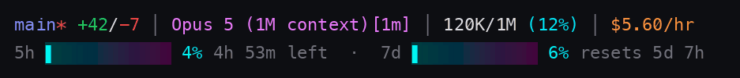
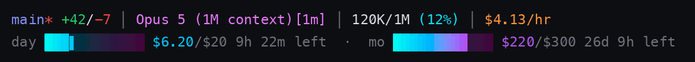

# claude-quota-planner

Two pieces that make Claude Code's subscription quota visible and plannable:

- **`statusline-quota.py`** — a status line that draws your **5-hour** and **7-day**
  quota as gradient bars, and writes each reading to disk.
- **`quota_planner.py`** — an MCP server that reads those readings, derives a real
  burn rate, and answers "does this task fit before the window resets?"

No credentials and no undocumented endpoints. Claude Code already sends
`rate_limits.five_hour` / `rate_limits.seven_day` to the status line command on
stdin; everything here is downstream of that. Exactly one tool makes a network
call — `reconcile_spend`, opt-in, documented, and covered [below](#billed-spend-instead-of-the-estimate).



```
main* +42/-7 │ Opus 5 (1M context) │ 469K/1M (47%) │ $12.29/hr
5h ━━━━━━╸───── 36%  3h 29m left      7d ━╸────────── 8%  resets 1d 8h
```

## Two ceilings, two modes

Which limit binds depends on how you authenticate, so the tools answer in whichever
unit is actually load-bearing:

| Auth | Mode | Ceiling | Unit |
|---|---|---|---|
| Claude.ai **Pro / Max** | `quota` | 5-hour window, 7-day window, and behind a [Claude apps gateway](https://code.claude.com/docs/en/claude-apps-gateway-spend-limits) a spend limit | percent |
| **API key, Bedrock, Vertex** | `spend` | the daily and monthly **USD budget you set** | dollars |

`rate_limits` reaches subscriber sessions only — pay-per-token auth has no
server-side window to report, which is why spend mode exists rather than the bars
sitting idle. It tracks `cost.total_cost_usd` across every session on the machine
and draws the same bars against your own ceiling:



```
main* +42/-7 │ Opus 5 (1M context) │ $6.15/hr
day ━━━━━━━━━╸── $15.80/$20  9h 44m left   ·   mo ━╸────────── $88/$300  26d left
```

Behind a gateway spend limit the subscriber line grows a third bar (`$lim`), and
the planner treats it as its own constraint rather than folding a different
denominator into the 5-hour arithmetic.

> Spend figures are Claude Code's **client-side estimate at list price** — not your
> invoice. `/clear` resets a session's counter; the ledger keys on `session_id` and
> accumulates deltas, so the daily total survives that.

### Billed spend instead of the estimate

For organizations on the Claude Console, the real invoiced numbers are available.
`reconcile_spend` pulls `GET /v1/organizations/cost_report` and replaces the local
estimate with billed dollars:

```
reconcile_spend(days=7)
```

Needs an **Admin API key** in `ANTHROPIC_ADMIN_KEY` (`sk-ant-admin01-…`) or an
`org:admin` OAuth token in `ANTHROPIC_ADMIN_OAUTH_TOKEN` / `ANTHROPIC_AUTH_TOKEN`.
`ANTHROPIC_API_KEY` is deliberately ignored — regular and workspace-scoped keys are
rejected by the endpoint anyway, and reaching for whatever key happens to be
exported is not a planning tool's business. The destination host is hard-coded.

Four things to know before turning it on:

- **The Admin API is unavailable for individual accounts.** It needs an
  organization. Claude Enterprise (claude.ai) orgs use a different Analytics API,
  and the endpoints are absent on Claude Platform on AWS.
- **Costs are org-wide.** The cost report takes no API-key or workspace filter, so
  on a shared org the figure includes your teammates. For per-user Claude Code
  cost, Anthropic's Claude Code Analytics API is the right endpoint instead.
- **Buckets are UTC days**, so switching sources moves the daily budget's
  denominator and its reset to UTC. The status line marks billed rows with `*`.
- **The burn rate stays local.** Cost report granularity is daily; an hourly rate
  has to come from the estimate series. Billed totals are exact, the rate is not.

Data appears within ~5 minutes of a request and the endpoint tolerates polling once
a minute, so calling `reconcile_spend` at the top of a session is plenty. Switch
back any time with `QUOTA_SPEND_SOURCE=local`, which overrides the file.

## Install

### Option A — as a plugin (recommended)

The repo is its own marketplace, so one add and one install wire up the MCP
server *and* the skill that tells Claude when to call it:

```
/plugin marketplace add FlukRocker/claude-quota-planner
/plugin install quota-planner@claude-quota-planner
```

Or from the CLI:

```bash
claude plugin marketplace add FlukRocker/claude-quota-planner
claude plugin install quota-planner@claude-quota-planner
```

That gives you:

| Surface | What appears |
|---|---|
| `/mcp` | `quota-planner` server — `quota_status`, `plan_session`, `check_budget`, `record_task_cost`, `set_budget` |
| `/skills` | `quota-planner:quota-planning` — when to call each tool and how to read the answers |
| `/quota-planner:quota-setup` | Installs the status line (see below) |

Plugin manifests **cannot** declare a `statusLine`, and the MCP server has nothing
to read until one is running. So finish the install with:

```
/quota-planner:quota-setup --dry-run   # show the plan
/quota-planner:quota-setup             # apply it
```

It links `statusline-quota.py` out of the plugin into `~/.claude/quota` (so plugin
updates flow through), backs up `~/.claude/settings.json`, and sets `statusLine`.
An existing status line is kept and rendered above the bars via
`CLAUDE_QUOTA_DELEGATE`; pass `--no-delegate` to replace it instead.

`uv` runs the server from the script's inline metadata and installs `mcp>=2.0.0`
into a throwaway env — nothing to set up by hand. Send one message so the first API
response populates `rate_limits`.

### Option B — manual

```bash
mkdir -p ~/.claude/quota
cp statusline-quota.py quota_planner.py ~/.claude/quota/
chmod +x ~/.claude/quota/statusline-quota.py
```

**1. Status line** — add to `~/.claude/settings.json`
(see `examples/settings.snippet.json`):

```json
{
  "statusLine": {
    "type": "command",
    "command": "python3 \"$HOME/.claude/quota/statusline-quota.py\"",
    "refreshInterval": 30
  }
}
```

Already have a status line? Keep it — set `CLAUDE_QUOTA_DELEGATE` to it and the
quota bars render underneath (`examples/settings.snippet.delegate.json`).

Pure stdlib, no dependencies. Send one message so the first API response
populates `rate_limits`.

**2. MCP server**

```bash
claude mcp add quota-planner -- uv run --script ~/.claude/quota/quota_planner.py
```

`uv` reads the inline script metadata and installs `mcp>=2.0.0` into a throwaway
env — nothing to set up by hand. The server refuses to start answering until the
status line has written its first snapshot; that dependency is the whole design.

**3. Teach Claude to use it** — the tools only pay off if they're called at the
right moments. Paste `examples/CLAUDE.md.snippet` into your `~/.claude/CLAUDE.md`.
(The plugin ships this as a skill instead, so Option A needs no CLAUDE.md edit.)

## Tools

| Tool | Does |
|---|---|
| `quota_status` | 5-hour used/remaining, weekly usage, time to reset, measured burn rate, and whether your current pace exhausts the window early |
| `plan_session` | Packs a task list into the quota *and* the clock left in the window. Returns what fits, what to defer past the reset, and where dropping to a cheaper model rescues a deferred task |
| `check_budget` | Go/no-go for one task before you start it, with a cheaper alternative when it doesn't fit |
| `record_task_cost` | Feeds back what a finished task actually cost, so estimates stop being guesses. `pct_used` on a subscription, `usd_used` on pay-per-token auth — they calibrate separate tables |
| `set_budget` | Sets the USD ceilings spend mode plans against, written to `budget.json` |
| `reconcile_spend` | Pulls billed USD from the Admin API cost report and switches spend mode onto it — the only tool that touches the network |

Every tool takes `mode` (`auto` follows the latest session; `quota` or `spend`
forces one) — useful when a subscriber session and an API-key session share the
same machine.

Tasks are sized in four buckets:

| Category | Means |
|---|---|
| `micro` | one-file edit, lookup, quick question |
| `small` | contained bug fix or small feature |
| `medium` | multi-file feature, refactor, test suite |
| `large` | migration, architecture change, long research/agent run |

### Calibration is the point

Anthropic publishes no token-to-quota mapping, so the shipped `SEED_PCT` numbers
are deliberately conservative placeholders. `SEED_USD` is no better: the ratios
track list pricing per million tokens (Opus 5 $5/$25, Sonnet 5 $2/$10, Haiku 4.5
$1/$5) but the absolute numbers are guesses about task shape. Each
`record_task_cost` call folds a real measurement into a rolling average (capped at
n=10 so it keeps adapting); after **two** samples for a given
category+model+**unit** the estimate switches from "seed" to your own data. Until
then, trust the burn rate over the table.

## Configuration

Both scripts read `CLAUDE_QUOTA_DIR` (default `~/.claude/quota`).

Status line only:

| Variable | Default | Does |
|---|---|---|
| `CLAUDE_QUOTA_DELEGATE` | — | Path to an existing status line to render above the bars |
| `QUOTA_BAR_STYLE` | `gradient` | `gradient` \| `solid` \| `ascii` |
| `QUOTA_BAR_PALETTE` | `cyber` | `cyber` \| `neon` \| `severity` |
| `QUOTA_BAR_WIDTH` | `12` | Cells per bar |
| `NO_COLOR` | — | Set to disable colour |

Spend mode (both scripts read these; they override `budget.json`):

| Variable | Does |
|---|---|
| `QUOTA_BUDGET_USD_DAILY` | Daily USD ceiling |
| `QUOTA_BUDGET_USD_MONTHLY` | Monthly USD ceiling |
| `QUOTA_SPEND_SOURCE` | `local` \| `cost_report` — overrides `budget.json` |
| `ANTHROPIC_ADMIN_KEY` | Admin API key, read only by `reconcile_spend` |
| `ANTHROPIC_ADMIN_OAUTH_TOKEN` | `org:admin` OAuth token, same purpose (falls back to `ANTHROPIC_AUTH_TOKEN`) |

Gradients need a truecolor terminal (`COLORTERM=truecolor`); otherwise use
`QUOTA_BAR_STYLE=ascii`.

## Files it writes

All under `CLAUDE_QUOTA_DIR`, all gitignored — this is your usage data:

| File | Holds |
|---|---|
| `snapshot.json` | Latest reading: both windows, reset times, model, session cost |
| `history.jsonl` | Append-only log of readings — burn rate is the delta between the first and last reading inside the current window |
| `costs.json` | Your calibrated per-category estimates (percent and USD under separate keys) |
| `spend.json` | Per-day and per-month USD totals, the per-session last-seen value the deltas are computed from, and any billed figures `reconcile_spend` fetched |
| `budget.json` | Your USD ceilings (`examples/budget.snippet.json`); env vars override it |
| `.gitcache.json` | Status line's git-status cache (keeps the line fast) |

## Demo GIFs

Both animations above are real status line output — `scripts/make_demo_gif.py` feeds
`statusline-quota.py` synthetic session JSON, parses the truecolor ANSI it prints,
and draws the cells. Regenerate them with:

```bash
uv run --with pillow scripts/make_demo_gif.py docs/statusline.gif quota
uv run --with pillow scripts/make_demo_gif.py docs/statusline-spend.gif spend
```

## License

MIT
